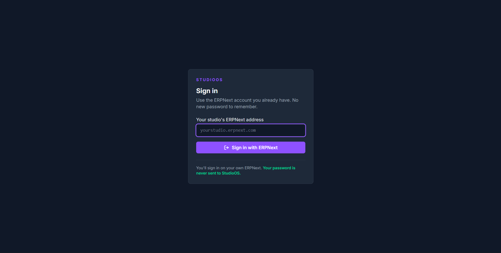
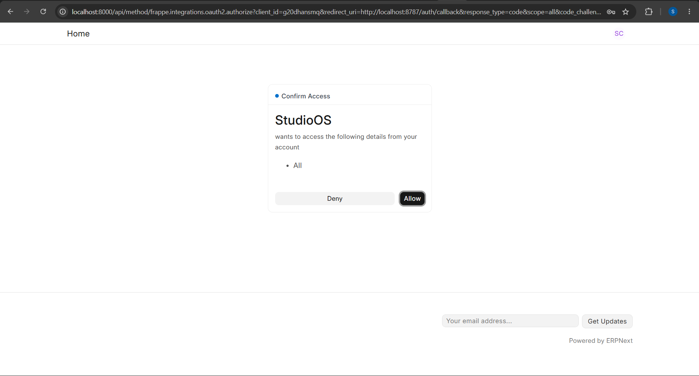

<div align="center">


# 🔑 OAuth Connector

**Turn any Frappe/ERPNext site into a login provider for your own application — in one command.**

[](license.txt)
[](https://frappeframework.com)
[](https://openid.net/developers/how-connect-works/)

</div>

---

## ✨ What this does

Frappe already ships a complete **OAuth 2.0 / OpenID Connect provider**. What it
does not ship is a way to get a client *registered* without a site administrator
opening the desk UI and filling in an `OAuth Client` record by hand.

This app does that on install — and, just as importantly, **removes the
credential cleanly on uninstall**.

| | |
|---|---|
| 🤝 **Registers your app** | Creates the `OAuth Client` record automatically |
| ⚙️ **Configured per site** | App name, callback URLs, scopes and roles all come from `site_config.json` |
| 🔁 **Idempotent** | `bench migrate` re-applies config; it never creates a second client |
| 🧹 **Cleans up after itself** | Uninstall deletes the client *and* every token issued against it |
| 🔒 **No passwords anywhere** | People sign in on their own site; your app only ever sees a token |

> [!NOTE]
> This app is **application-agnostic**. Nothing about it is tied to a particular
> product — you set your own app name and callback URL, and that is what site
> users see and what the site redirects to.

---

## 📸 What your users see

**1. They sign in on your application** — typing only their own site's address.
Their password is never sent to you.

<div align="center">
  
</div>

**2. Their own Frappe site asks them to approve.** The name and the scopes on
this screen come from *your* configuration — set `oauth_connector_client_name`
and this is where it appears.

<div align="center">
  
</div>

Approve, and the site redirects back to your callback URL with an authorization
code. That is the whole user-facing story.

---

## 🧭 How it works

```
   YOUR APP                    THE CUSTOMER'S FRAPPE SITE
   ────────                    ─────────────────────────

   ① user types their site address
        │
        ├──▶ GET /.well-known/openid-configuration
        │         ◀── every endpoint, discovered, not hardcoded
        │
   ② redirect the browser to the site's /authorize
        │         (response_type=code, PKCE challenge, state)
        │
        │                      ③ the site logs the user in
        │                         — on the site, not on you
        │
        │                      ④ consent screen: "<your app>
        │                         wants to access…"  Allow / Deny
        │
        ◀── ⑤ redirect back to your callback with ?code=…&state=…
        │
        ├──▶ POST /token   code + PKCE verifier + client secret
        │         ◀── access token (+ refresh token)
        │
   ⑥ every later request carries that token, and the site
     runs it AS THAT USER — their roles, their permissions
```

**Where this app fits:** steps ② and ④ need an `OAuth Client` record to exist on
that site, holding your app's name, client ID, secret, callback URL and scopes.
Creating it is the job this app automates. Everything else is Frappe's own
built-in OAuth provider doing the work.

### 🧨 Why the uninstall half matters

`OAuth Client` is a **Frappe core doctype**. It does not belong to this app's
module, so a plain `bench uninstall-app` **leaves the record behind** — a site
that removed the integration would still be handing out a live client ID and
secret against its own data.

`before_uninstall` deletes the client along with every bearer token and
authorization code issued under it. This is the part you cannot get by creating
the record by hand.

---

## 🚀 How to use

### 1️⃣ Install — pick one of two ways

<table>
<tr>
<td width="50%" valign="top">

#### 🅰️ From the Frappe Marketplace

**For sites on Frappe Cloud.** No shell, no bench, nothing to clone.

1. Open your **Frappe Cloud dashboard**
2. Go to **Marketplace** and search for **OAuth Connector**
3. **Install** it on the site you want
4. Frappe Cloud handles the app install and migrate for you

This is the only route on a **managed** Frappe Cloud plan, which does not allow
installing apps from arbitrary Git URLs.

</td>
<td width="50%" valign="top">

#### 🅱️ From source with bench

**For self-hosted benches and Frappe Cloud private benches.**

```bash
bench get-app https://github.com/TangadeSandesh/oauth_connector
bench --site your-site.com install-app oauth_connector
```

The client ID is printed as it registers:

```
[oauth-connector] registered, client_id=xxxxxxxxxx
```

</td>
</tr>
</table>

> [!TIP]
> **Set the configuration in step 2 _before_ you install**, and it is applied on
> the first run — `after_install` reads it there and then. Configure afterwards
> and you need a migrate to pick it up, which is easy with bench and one extra
> dashboard action without it.

### 2️⃣ Point it at your application

The settings live in the site's config, whichever way you installed:

```json
{
  "oauth_connector_client_name": "Your App Name",
  "oauth_connector_redirect_uris": ["https://yourapp.com/auth/callback"],
  "oauth_connector_scopes": "all",
  "oauth_connector_allowed_roles": ["Desk User"]
}
```

| Installed via | Where to put it | How to apply it |
|---|---|---|
| 🅰️ Marketplace | Dashboard → your site → **Config** | Trigger a **Migrate** from the site's actions |
| 🅱️ bench | `sites/your-site.com/site_config.json` | `bench --site your-site.com migrate` |

`after_migrate` re-runs registration, so config changes are picked up and **no
second client is ever created** — running it twice is safe.

### 3️⃣ Read the credentials

```bash
curl -u "api_key:api_secret" \
  https://your-site.com/api/method/oauth_connector.api.get_registration
```

```json
{
  "site": "https://your-site.com",
  "openid_configuration": "https://your-site.com/.well-known/openid-configuration",
  "app_name": "Your App Name",
  "client_id": "...",
  "client_secret": "...",
  "redirect_uris": ["https://yourapp.com/auth/callback"],
  "scopes": "all",
  "allowed_roles": ["Desk User"]
}
```

> [!IMPORTANT]
> **System Manager only** — it returns the client secret. Have your application
> read `openid_configuration` rather than hardcoding endpoints: Frappe serves a
> complete OIDC discovery document, so authorize, token, userinfo, introspection
> and revocation are all discoverable from the domain alone.

### 4️⃣ Check it worked

Works on any install — the site should describe itself as its own issuer:

```bash
curl https://your-site.com/.well-known/openid-configuration
```

And the client record should exist. **In the desk UI** (no shell needed), open
**OAuth Client** from the awesomebar and confirm your app name and callback URL
are on it. Or with bench:

```bash
bench --site your-site.com console
>>> frappe.get_all("OAuth Client", fields=["name", "app_name", "redirect_uris"])
```

### 5️⃣ Uninstall

| Installed via | How |
|---|---|
| 🅰️ Marketplace | Dashboard → your site → **Apps** → remove **OAuth Connector** |
| 🅱️ bench | `bench --site your-site.com uninstall-app oauth_connector` |

```
[oauth-connector] removed OAuth client xxxxxxxxxx and its tokens
```

Either route runs `before_uninstall`, so the client and its tokens go with it.

---

## ⚙️ Configuration

All keys go in the site's config.

| Key | Default | Purpose |
|---|---|---|
| `oauth_connector_client_name` | **required** | 🏷️ Application name shown on the consent screen |
| `oauth_connector_redirect_uris` | **required** | 🔗 String or list of accepted callback URLs |
| `oauth_connector_scopes` | `all openid` | 🎯 Scopes granted to the client |
| `oauth_connector_allowed_roles` | `["Desk User"]` | 👥 **Who may sign in** — read the warning below |

> [!IMPORTANT]
> **The first two have no defaults, deliberately.** There is no safe value to
> guess: a guessed name shows a stranger's application on the consent screen,
> and a guessed callback URL sends a user's authorization code to somebody
> else's server.
>
> Install with them unset and **nothing is registered** — the install still
> succeeds, and prints exactly what to add:
>
> ```
> [oauth-connector] not configured yet, so no OAuth client was created.
> [oauth-connector] Add to this site's config:
> [oauth-connector]     "oauth_connector_client_name": "Your App Name"
> [oauth-connector]     "oauth_connector_redirect_uris": ["https://yourapp.com/auth/callback"]
> [oauth-connector] then run `bench --site <site> migrate` (or trigger a migrate
> [oauth-connector] from the Frappe Cloud dashboard).
> ```

Renaming the application later is safe: the existing client is **renamed in
place** rather than left behind, so the site never accumulates a second,
unowned credential.

Developing against a local client app:

```json
{
  "oauth_connector_redirect_uris": ["http://localhost:8787/auth/callback"]
}
```

### 🚦 Who may sign in — read this before onboarding staff

Frappe decides whether a user may use an OAuth client by intersecting the
client's **Allowed Roles** with the user's own roles:

```python
return bool(allowed_roles & set(frappe.get_roles()))
```

Two consequences, both easy to lose an afternoon to:

- ❌ **An empty list refuses everyone**, including the owner. The empty
  intersection is falsy.
- 🤥 **The refusal is reported as `Invalid client_id`.** Frappe blames the
  client, not the user's roles — so you go hunting for a typo in the client ID
  while the real cause is a missing role on a user.

The classic symptom is a brand-new employee. They exist, they have a password,
and sign-in refuses them with an error pointing at entirely the wrong thing.

The default `["Desk User"]` matches Frappe's own and covers every System User.
Widen it when people who are not desk users need to sign in:

```json
{ "oauth_connector_allowed_roles": ["Desk User", "Projects User"] }
```

Then `bench --site your-site.com migrate`. The list is **replaced, not merged**,
so removing a role from the config really removes it. Roles that do not exist on
the site are skipped with a warning — and if *none* of them exist, the app
refuses to write the client at all rather than leaving one that silently rejects
every user.

---

## 🧩 Notes for the client application

- 🔐 **ID tokens are HS256-signed** with the client secret, not a public key.
  There is no JWKS, so they cannot be verified in a browser. **Keep token
  handling server-side.** If your OAuth library verifies asymmetric signatures
  only, do not request the `openid` scope — resolve identity from
  `frappe.auth.get_logged_user` on the access token instead, which is a stronger
  claim anyway: the site answering about the token you actually hold.
- 🔁 **Use the authorization code flow with PKCE.** The site also advertises
  implicit response types; do not use them.
- 🧑‍⚖️ **Requests run as the user.** The site's own role permissions apply, so
  your application needs no permission model of its own — and cannot exceed what
  that person could do in Frappe.
- ↪️ **Discovery may redirect.** Behind a production proxy
  `/.well-known/openid-configuration` returns 200 directly, but a bench dev
  server **301s** it. Follow redirects on discovery only — never on the token
  exchange, where following one could leak the code or secret to another host.
- ✅ **Consent is a real step.** The flow is authorize → login → consent →
  approve → callback, not authorize → callback.

---

## 🛠️ Contributing

This app uses `pre-commit` (ruff, eslint, prettier, pyupgrade):

```bash
cd apps/oauth_connector
pre-commit install
```

---

## 📄 License

[MIT](license.txt)
